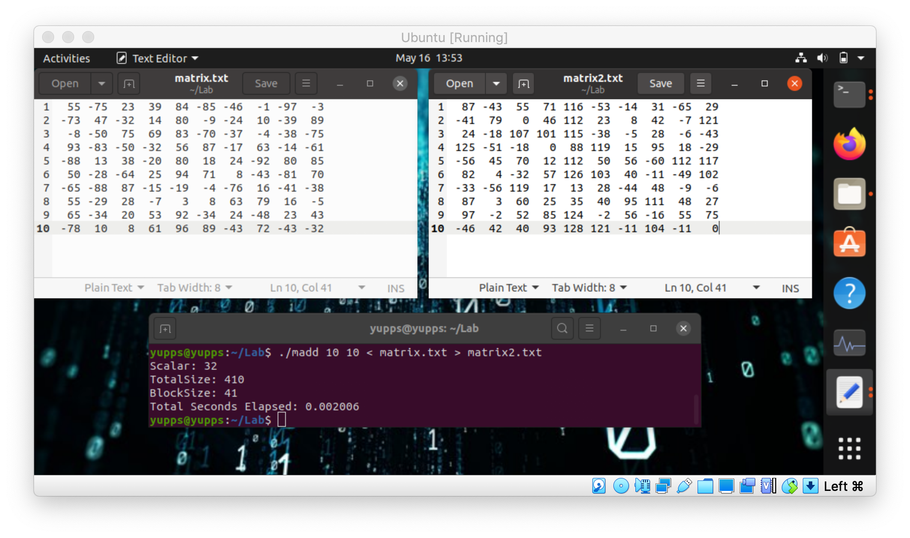

First run at trying to add an image so don't judge me
    
LAB 7  
Run matrix_gen size > matrix.txt  
Will create a matrix thats 8X8 with 4 char padding  
Run matrix_add size blocks < matrix.txt > matrix2.txt  
Will break the matrix into blocks and add a random scalar to the whole matrix
